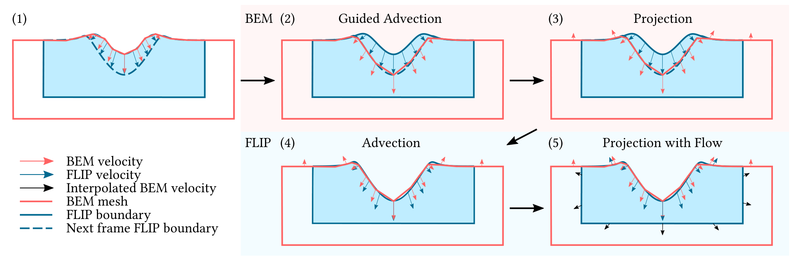
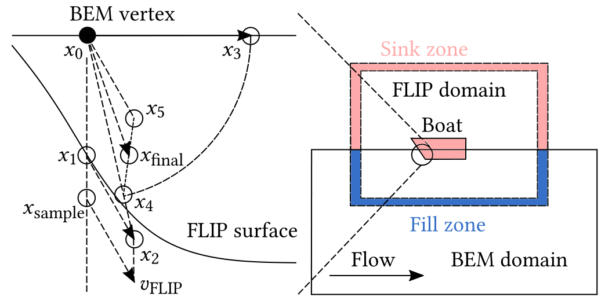

# Ships, Splashes, and Waves on a Vast Ocean

## Motivation

FLIP 非常适合模拟与物体接触产生水花的现象，但是难以有效的传递类似波浪的效果。仿真高分辨率的宽阔且深的水面只是为了展现低频的波浪效果非常划不来，如果只是模拟浅水则会影响仿真效果，水的深度重要的决定了水面的形状（由之前的工作指出）[Nielsen and Bridson 2011]。
然而持续时间长，传播范围广德水波依旧难以被保持下来

以前也有很多脱离体积模拟的策略，但是大多难以处理与障碍物间的耦合以及会产生不正确的水波效果。并且很难与体积NS解算器之间进行双向耦合(高度场<->速度-压力)

本文采用了不同的策略，混合了局部高分辨率的FLIP方法和基于表面的BEM用于模拟广阔深邃的充满细节的海洋模型。

## Contribution

## Method

### FLIP and BEM

governing equation 使用的是标准的不可压缩欧拉形式
$$
\begin{aligned}
\frac{\operatorname{D} \bm{u}}{\operatorname{D} t} &= - \frac{1}{\rho}\nabla P + \bm{g} \\
\nabla\cdot\bm{u} &= 0
\end{aligned}
$$

BEM 在进行水体模拟时使用三角网格模拟液体表面，通过对三角网格的顶点进行平流，会产生三角面片碰撞的情况（水滴之间的碰撞）。
为了处理此类情况使用 LosTopos[Da et al.2014] 的一种基于网格的表面追踪方法来处理水体碰撞带来的拓扑变化。

### FlIP influence on the BEM

需要一个非入侵性的方式 non-intrusive

splashes会存在于FLIP的模拟中，BEM去跟踪这些水花是无意义的，因为他们终究会合并到主水体中。
所以我们只要求BEM去跟踪FLIP液体表面平滑过的SDF。

coupling progress:

### BEM Influence on the FLIP

困难点在于如何去计算 BEM 网格内部的速度，如果沿用以前将网格内布体素化的方式非常低效。
如果依靠最近邻点，则不符合物理规则。

开尔文船波现象

